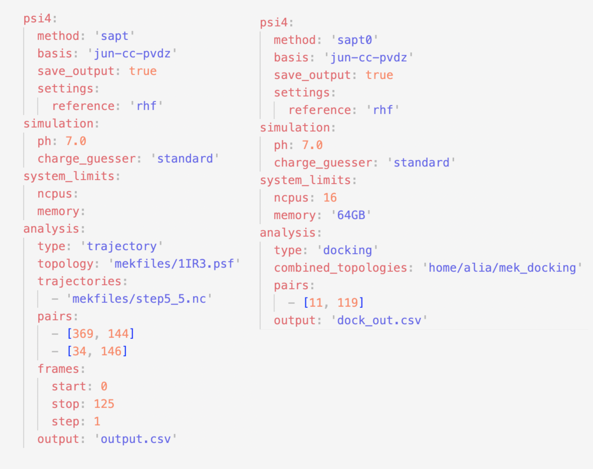
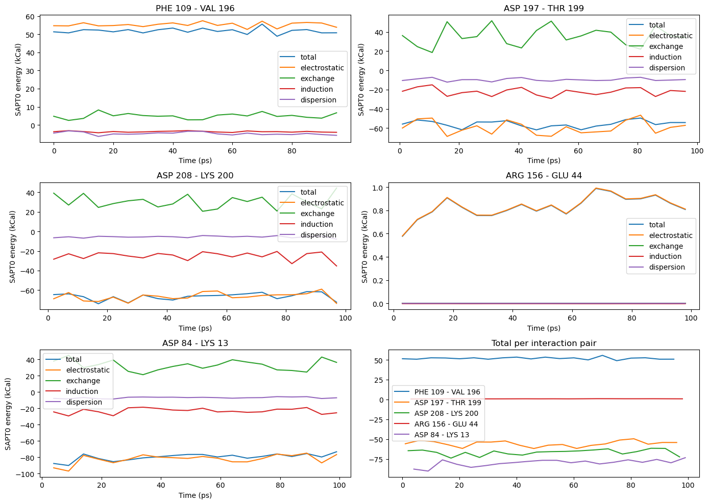

# Summary
Molecular dynamics (MD) simulations can identify important interactions in biomolecular systems and examine how these interactions change over the course of the simulation.
Biomolecular interactions modeled with MD can be also analyzed in more detail using quantum chemical methods. 
To accomplish this, we developed MD-SAPT, an open-source Python package, to perform quantum calculations as a post-processing analysis of MD data to quantify and decompose non-covalent interaction energy.
MD-SAPT has two modes of analysis: trajectory, which analyzes selected interaction pairs over the frames of an MD simulation, and docking, to examine the binding interactions between a protein and different ligands or compare different docking poses for one particular ligand to determine the relative magnitude of the interactions.

# Statement of Need
Non-covalent interactions govern many important biochemical processes, and are most accurately modeled by quantum chemical methods [@lipkowitz; @wilson].
Quantum methods can also offer more detailed information about an interaction; for example, 
Symmetry Adapted Perturbation Theory (SAPT), decomposes the interaction energy of the fragments into its component interaction types: electrostatic, dispersion, induction and exchange [@patkowski].

The molecular mechanics methods used in MD simulations do not characterize noncovalent interactions at the same level of detail as quantum mechanical methods, but allow simulations of large biomolecular systems [@lipkowitz].
In this work, we present a workflow tool to utilize ab initio methods as a post-processing technique on MD data, offering detailed insight into the strength and type of noncovalent interactions interactions.
MD-SAPT automates this process in a reproducible way.
It is released as an open source Python library, and distributed using Anaconda on the psi4 conda channel.
It supports macOS and Linux, and can be used as a CLI tool, in an interactive Jupyter Notebook, or as an importable Python library. 

MD-SAPT automates the process of applying SAPT calculations to structures generated from molecular dynamics simulations.  It combines multiple workflow tasks, including selecting the specific residues for the QM calculation, adding protons where the residues were bound to the polypeptide chain, determining the formal charge, passing the charge and coordinates into psi4 (the QM calculation program), and saving the results. 

Currently, a number of python based analysis tools exist for MD data.  Some popular packages include 
MDtraj, pyLOOS, and MDAnalysis (need citations here? [@mcgibbon; @romo; @michaud; @gowers]).  MDAnalysis is a core dependency of MD-SAPT and utilizing existing tools as the starting point for an analysis allows for the development of more complex user-specific methodologies needs without requiring the reimplementation of the basic file processing needed to access MD data.

Specifically, we designed MD-SAPT as an MDA-kit, a plugin in the MDAnalysis ecosystem, by extending its existing analysis interface [@Alibay2022].
This is similar to the existing pyLOOS ecosystem, where smaller packages are built using the existing interface for analysis, while the library processes the MD data into a standardized object [@romo].
Furthermore, this model has the additional advantage that users are only required to install the tools as well as their associated dependencies specific to their work.

# Demonstration

MD-SAPT has two analysis modes. `TrajectorySAPT` calculate the SAPT interaction energy between two (is it just two or could it be two groups?) specified residues for snapshots selected from an MD trajectory. `DockingSAPT` analyzes interactions between similar topologies, such as different molecules in the same active site or a molecule in various poses in an active site.
The workflow for each mode is very similar, but each mode uses different classes for their analyses, and have slight differences in the required user-specified parameters.

In MD-SAPT user-specified parameters are provided in a yaml input file.
A template to generate blank input files is provided and can be generated using the command `MDSAPT generate [filename]`.
This provides users with a preformatted file, such that they only need to fill in their parameters without any additional formatting.
The input files for docking and trajectory are slightly different, since the docking mode reqiures several topologies and no trajectory, and the trajectory mode requires a topology and one or more trajectories. An example of each is given in figure \autoref{fig:input}.



With an input file, running the analysis only requires a few lines of code.

```Python
    import mdsapt

    config = mdsapt.load_from_yaml_file('runinput.yaml')
    sapt_run = mdsapt.TrajectorySAPT(config)
    sapt_run.run(config.start, config.stop, config.step)
    sapt_run.results.to_csv('results.csv')
```

The line beginning with  `config = mdsapt.load_from_yaml_file('runinput.yaml')` creates a `Config` object.
The `Config` object holds the information needed for an analysis, and when initialized, runs several tests.
These test ensure that any errors in the input file, like incorrect file paths or large out-of-bounds parameters are caught early, and highlighted to the user.
When loading a `Config` from an input file, it is impossible to get an invalid `Config`, eliminating errors for emerging later in the program. The next line `sapt_run = mdsapt.TrajectorySAPT(config)` initializes the Analysis object, in this case, a `TrajectoryAnalysis`.
Encapsulating analyses within a class is a design pattern drawn from MDAnalysis to simplify our code.
The next line, `sapt_run.run(config.start, config.stop, config.step)`, runs the analysis frame by frame, creating Psi4 inputs as it iterates through the user's chosen residues and frames.
In MDAnalysis user defined analyses, such as the sapt_run method here, are based on the `AnalysisBase` abstract class.
`AnalysisBase` contains an abstract methods for preforming the analysis that are called as its `run` method handles iterating over the MD frames.
Finally,  `sapt_run.results.to_csv('results.csv')` saves the results, which are stored in a `DataFrame`.

The previous example examined the trajectory analysis method.  There are a few key differences between it and the docking analysis method. On the user end, docking is preformed using the class `DockingSAPT` and has slightly differnt input parameters.
`DockingSAPT` was implemented using modified code from the `Ensemble` framework developed for [MDPOW](mdpow.readthedocs.io) [@lescoulie].

More detailed documentation is available at our [readthedocs page](mdsapt.readthedocs.io).

Using data provided in the MDAnalysis tests we generated the following results from a trajectory analysis over the protein 4AKE. This result was generated as a demonstration of the kinds of data MD-SAPT can generate. The code used to generate this data is available in the binder demo linked on the homepage of our documentation, note that it was for an older version of the software.



# Ongoing Applications in Research

The idea for MD-SAPT's mixed methods approach emerged from our work analyzing active site interactions within MD data.
Previously our group preformed MD simulations the protein MEK1, a dual-factor human kinase responsible for cell cycle regulation, and potential targe for chemotherapeutics [@sabsay].
Currently, we are applying MD-SAPT to further analyze active site interactions between MEK1 and ATP, working towards a better understanding the activation mechanism.

# Acknowledgements

This work was supported by the Bill and Linda Frost Fund at Cal Poly San Luis Obispo.
We acknowledge the support of NSF award CHE-2018427. This award provided the computational resources to support this project through the MERCURY Consortium Skylight cluster on Palmetto.
# References
